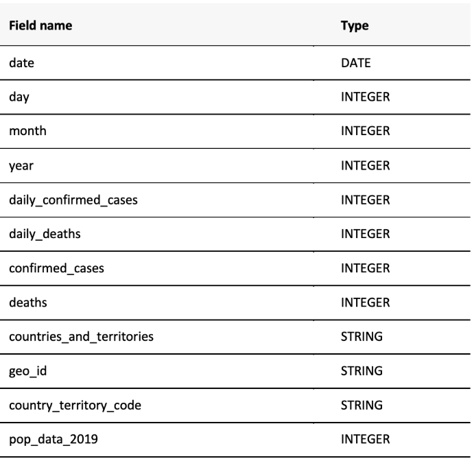

# SQL-COVID-19-Analysis_BIGQUERY
Data was analyzed on 09/03/2020.

## Exploratory Analysis

### 1. What columns and data type are there?



### 2. How does the table look like?

```sql
SELECT
	*
FROM
	`bigquery-public-data.covid19_ecdc.covid_19_geographic_distribution_worldwide`
```

### 3. Get a list of all countries available in the dataset.

```sql
SELECT
	DISTINCT countries_and_territories
FROM
	`bigquery-public-data.covid19_ecdc.covid_19_geographic_distribution_worldwide`
ORDER BY 
	countries_and_territories DESC;
```

This gives an output letting us know that there are 210 different countries.

## Data Analysis

### 4. What is the total number of cases of COVID-19 today globally?

```sql
SELECT
	SUM(confirmed_cases) 
FROM
	`bigquery-public-data.covid19_ecdc.covid_19_geographic_distribution_worldwide`
WHERE 
	date = '2020-09-03';
```

2020-09-03 was the last dat available in the data set when analyzing it. By using an aggregation function (SUM), SQL will show the total number of cases. 

### 5. **What are the top countries with the highest number of cases at the moment?**

```sql
SELECT
	countries_and_territories, 
	confirmed_cases
FROM
	`bigquery-public-data.covid19_ecdc.covid_19_geographic_distribution_worldwide`
WHERE
	date = '2020-09-03'
ORDER BY
	confirmed_cases DESC
LIMIT
	20;
```

By adding the column countries_and_territories, I was able to see the countries as well. By ordering it in descending order and limiting the number to 20, I got the top 20 countries with the highest number of cases. 

### 6. **What countries are most effected with covid-19 compared to their total population? (%)**

```sql
SELECT
	countries_and_territories,
	pop_data_2019,
	confirmed_cases,
	confirmed_cases / pop_data_2019 * 100 AS cases_as_percentage_of_population
FROM
	`bigquery-public-data.covid19_ecdc.covid_19_geographic_distribution_worldwide`
WHERE
	date = '2020-09-03'
ORDER BY
	cases_as_percentage_of_population DESC
LIMIT
	20;
```

In this case I also wanted to know the ratio, the percentage of how many people had covid  compared to the total population.  A high percentage would mean that these countries were high-risk and affected a lot. I selected the countries, the population data, the confirmed cases and used a calculation and saved it to a new calculated column. 

### 7. Which countries grew the most in number of cases last month?

```sql
SELECT
	countries_and_territories,
	SUM(daily_confirmed_cases) AS total_growth, 
FROM
	`bigquery-public-data.covid19_ecdc.covid_19_geographic_distribution_worldwide` 
WHERE
	year = 2020
	AND month = 8 
GROUP BY
	countries_and_territories
ORDER BY 
	total_growth DESC
LIMIT
	20;
```

With this business question I wanted to test my skills to select a specific month. I defined the growth with the daily number of cases. This would give at the end a number with how many cases had appeared in that month. By putting it in order, I was able to see which country had the most cases added. 

### 8. **Are the daily cases in the Netherlands in the May 2020 higher or lower than its monthly average?**

I am not even sure if this question (and my query) make sense. I just learned about sublist and wanted to practice it with the Covid-19 Data set. I am from the Netherlands, so I used that as a sample country.  This is the query I came up with: 

```sql
SELECT
	date, daily_confirmed_cases, 
	(SELECT
		AVG(daily_confirmed_cases) 
	FROM
		`bigquery-public-data.covid19_ecdc.covid_19_geographic_distribution_worldwide`
	WHERE
		countries_and_territories = 'Netherlands' AND year = 2020
		AND month = 5) AS average_daily_cases
FROM
	`bigquery-public-data.covid19_ecdc.covid_19_geographic_distribution_worldwide`
WHERE
	countries_and_territories = 'Netherlands' AND year = 2020
	AND month = 5
ORDER BY
	date;
```

